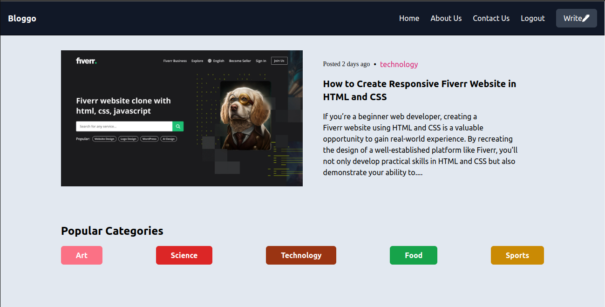
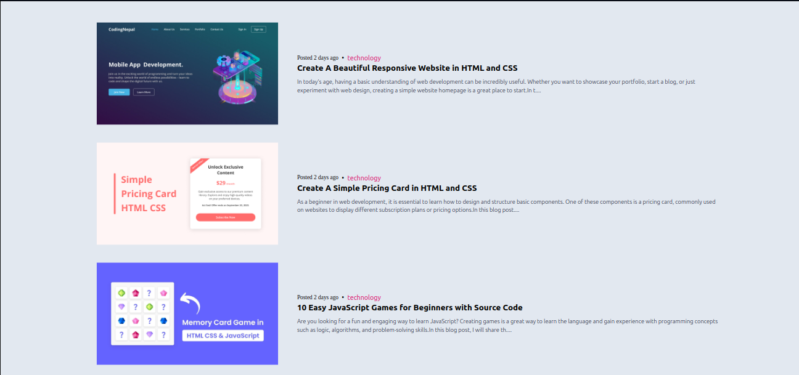
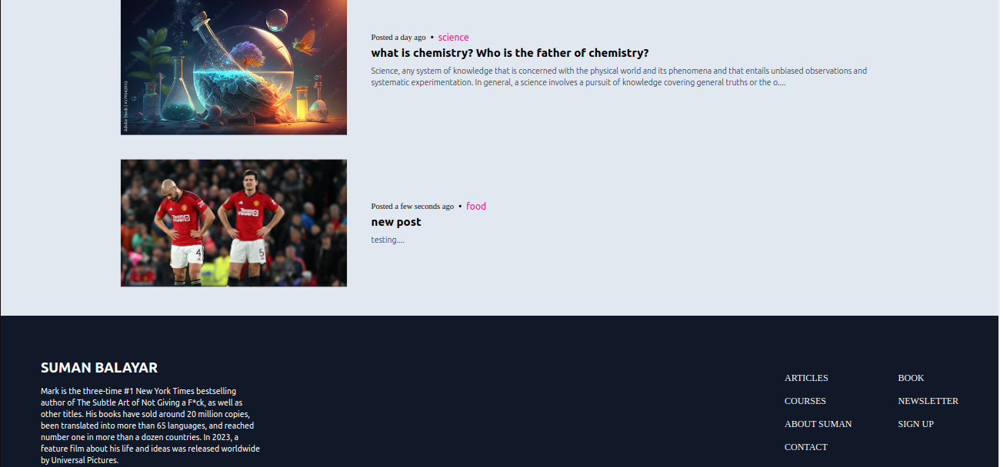

# Project Name

FullStack Blog App

## Table of Contents

1. [Introduction](#introduction)
2. [Screenshots](#screenshots)
3. [Demo](#demo)
4. [Installation](#installation)


## Introduction

Basic Frontend Design of a Full Stack Blog App

## Screenshots

Welcome to my awesome project. Here are some screenshots to give you a glimpse of what it looks like:









## Demo

This is the link to a live demo of this project (if applicable). This is hosted in netlify platform.


## Installation

Here is the detailed process of how you can install this design in your machine.

```bash
# Clone the repository
git clone https://github.com/sumanbalayar08/full_stack_blog_app.git

# Navigate to the client directory
cd client

# Install dependencies
npm install

# Start the development server
npm start

#Navigate to backend directory
cd backend

#Install Dependencies
npm install

#Start the backend server
npx nodemon index.js
